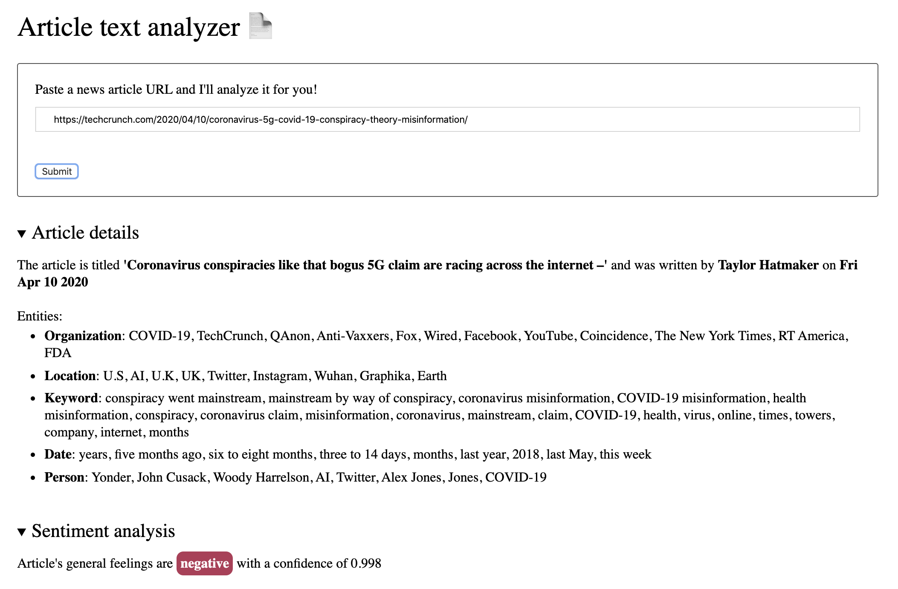

# Natural Language Processing (NLP) API Udacity's front end nanodegree project

This project uses [Aylien's NLP API](https://aylien.com/) to analyze news articles.

## How to run it

Follow these steps:

- Clone this repo
- Install depedendencies with npm install.
- Create account and API keys on [Aylien's website](https://aylien.com/).
- Create .env file at root directory and add APP_ID and API_KEY values with your own API keys.
- For development environment:
   - Open src/server/index.js and make sure the root GET endpoint its configured to server your client index.html file
   - Run `npm run build-dev` in one terminal.
   - Run `npm start` in another terminal
   - Open src/server/index.js and make sure the root GET endpoint its configured to server your **client** index.html file
- For production environment:
   - Open src/server/index.js and make sure the root GET endpoint its configured to server your **dist** index.html file
   - Run `npm run build-prod`
   - Run `npm start` and open your localhost at port 8081

## Tests

To run the test suite execute the command `npm test`. Tests are written with Jest.
